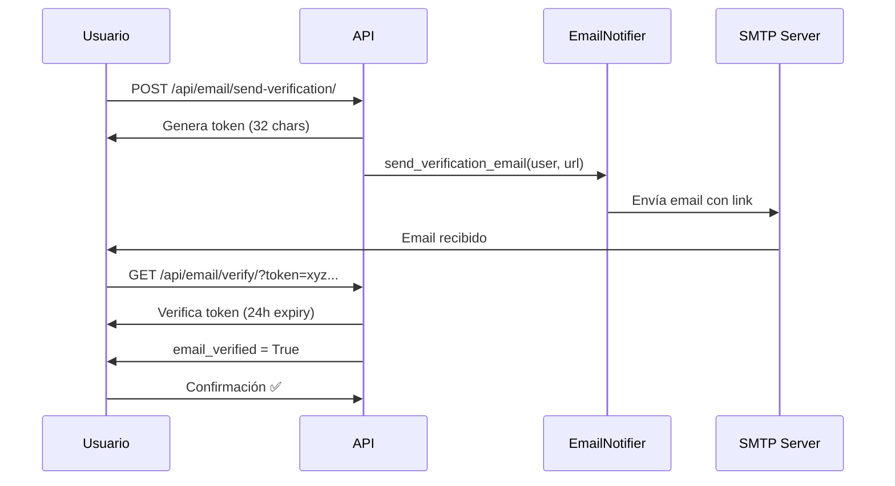

# 📧 Integración de Notificaciones por Email - IoT Sensor Platform

## 📋 Índice
1. [Descripción General](#descripción-general)
2. [Configuración](#configuración)
3. [Campos del Modelo de Usuario](#campos-del-modelo-de-usuario)
4. [API Endpoints](#api-endpoints)
5. [Helper de Email](#helper-de-email)
6. [Flujo de Verificación](#flujo-de-verificación)
7. [Ejemplos de Uso](#ejemplos-de-uso)
8. [Plantillas de Email](#plantillas-de-email)

---

## 🎯 Descripción General

Sistema completo de notificaciones por correo electrónico con:
- ✅ **Verificación de email** con tokens seguros
- 📨 **Envío de notificaciones** HTML con estilos
- 🚨 **Alertas de dispositivos** y sensores
- 🔐 **Control de preferencias** por usuario
- 🎨 **Plantillas HTML** profesionales

---

## ⚙️ Configuración

### 1. Variables de Entorno (`.env`)

```env
# Email Configuration (SMTP)
EMAIL_BACKEND=django.core.mail.backends.smtp.EmailBackend
EMAIL_HOST=smtp.gmail.com
EMAIL_PORT=587
EMAIL_USE_TLS=True
EMAIL_USE_SSL=False
EMAIL_HOST_USER=tu_email@gmail.com
EMAIL_HOST_PASSWORD=tu_contraseña_de_aplicacion
DEFAULT_FROM_EMAIL=noreply@iotsensor.com
SERVER_EMAIL=server@iotsensor.com
EMAIL_NOTIFICATIONS_ENABLED=True
EMAIL_TIMEOUT=10
```

### 2. Configuración de Gmail

Para usar Gmail necesitas una **contraseña de aplicación**:

1. Ve a tu cuenta de Google: https://myaccount.google.com/
2. Navega a **Seguridad** → **Verificación en dos pasos** (actívala si no lo está)
3. Ve a **Contraseñas de aplicaciones**: https://myaccount.google.com/apppasswords
4. Selecciona **Correo** y **Otro (nombre personalizado)**
5. Escribe "IoT Sensor Platform"
6. Copia la contraseña generada (16 caracteres)
7. Pégala en `EMAIL_HOST_PASSWORD` en tu archivo `.env`

### 3. Otros Proveedores SMTP

#### Outlook/Hotmail
```env
EMAIL_HOST=smtp-mail.outlook.com
EMAIL_PORT=587
EMAIL_USE_TLS=True
EMAIL_HOST_USER=tu_email@outlook.com
```

#### SendGrid
```env
EMAIL_HOST=smtp.sendgrid.net
EMAIL_PORT=587
EMAIL_USE_TLS=True
EMAIL_HOST_USER=apikey
EMAIL_HOST_PASSWORD=tu_api_key_de_sendgrid
```

#### Amazon SES
```env
EMAIL_HOST=email-smtp.us-east-1.amazonaws.com
EMAIL_PORT=587
EMAIL_USE_TLS=True
EMAIL_HOST_USER=tu_smtp_username
EMAIL_HOST_PASSWORD=tu_smtp_password
```

---

## 👤 Campos del Modelo de Usuario

El modelo `CustomUser` incluye los siguientes campos para email:

```python
# Integración Email
email_notifications_enabled = BooleanField(default=True)
email_verified = BooleanField(default=False)
email_verification_token = CharField(max_length=100, unique=True)
email_verification_sent_at = DateTimeField()
```

### Métodos del Modelo

```python
# Propiedad para verificar si puede recibir notificaciones
@property
def can_receive_email_notifications(self):
    return (
        self.email_notifications_enabled and
        self.email_verified and
        self.email
    )

# Generar token de verificación (expira en 24 horas)
user.generate_email_verification_token()

# Verificar token
success, message = user.verify_email_token(token)
```

---

## 🔌 API Endpoints

### 1. Enviar Email de Verificación
```http
POST /api/email/send-verification/
Authorization: Bearer <token>
```

**Respuesta exitosa:**
```json
{
  "success": true,
  "message": "Email de verificación enviado a usuario@example.com",
  "email": "usuario@example.com"
}
```

---

### 2. Verificar Token de Email
```http
GET /api/email/verify/?token=xyz123...
Authorization: Bearer <token>
```

O con POST:
```http
POST /api/email/verify/
Authorization: Bearer <token>
Content-Type: application/json

{
  "token": "xyz123..."
}
```

**Respuesta exitosa:**
```json
{
  "success": true,
  "message": "Email verificado exitosamente",
  "email_verified": true
}
```

---

### 3. Actualizar Preferencias de Email
```http
POST /api/email/preferences/
Authorization: Bearer <token>
Content-Type: application/json

{
  "email_notifications_enabled": true
}
```

**Respuesta:**
```json
{
  "success": true,
  "message": "Preferencias actualizadas",
  "email_notifications_enabled": true,
  "can_receive_email_notifications": true
}
```

---

### 4. Enviar Notificación (Superusuarios)
```http
POST /api/email/send-notification/
Authorization: Bearer <token>
Content-Type: application/json

{
  "user_ids": [1, 2, 3],
  "message": "<h3>Mantenimiento programado</h3><p>El sistema estará en mantenimiento mañana de 2-4 AM</p>",
  "subject": "Mantenimiento del Sistema",
  "notification_type": "warning"
}
```

**Respuesta:**
```json
{
  "success": true,
  "message": "Notificaciones enviadas: 3 exitosos, 0 fallidos",
  "results": {
    "sent": 3,
    "failed": 0,
    "errors": []
  }
}
```

---

### 5. Obtener Estado de Email
```http
GET /api/email/status/
Authorization: Bearer <token>
```

**Respuesta:**
```json
{
  "has_email": true,
  "email": "usuario@example.com",
  "is_verified": true,
  "notifications_enabled": true,
  "can_receive_notifications": true,
  "verification_sent_at": "2025-12-05T19:30:00Z",
  "has_pending_verification": false
}
```

---

## 🛠️ Helper de Email

### Uso del EmailNotifier

```python
from apps.accounts.email_helper import email_notifier

# 1. Enviar email simple
success, data = email_notifier.send_simple_email(
    to_email='usuario@example.com',
    subject='Hola',
    message='Este es un mensaje de prueba'
)

# 2. Enviar email HTML
html_content = """
<h1>Título</h1>
<p>Contenido con <strong>formato</strong></p>
"""
success, data = email_notifier.send_html_email(
    to_email='usuario@example.com',
    subject='Email con HTML',
    html_content=html_content
)

# 3. Enviar notificación a un usuario
success, data = email_notifier.send_notification_to_user(
    user=user,
    message='🎉 Tu cuenta ha sido activada',
    notification_type='success',  # success, info, warning, error
    subject='Cuenta Activada'  # opcional
)

# 4. Enviar notificación a múltiples usuarios
users = CustomUser.objects.filter(rol__nombre='operador')
results = email_notifier.send_notification_to_users(
    users=users,
    message='⚠️ Actualización del sistema programada',
    notification_type='warning'
)

# 5. Enviar alerta de dispositivo
results = email_notifier.send_device_alert(
    device=dispositivo,
    alert_type='connection',  # connection, error, warning, info
    message='El dispositivo se ha desconectado',
    recipients=[operador1, operador2]  # opcional
)

# 6. Enviar alerta de lectura de sensor
results = email_notifier.send_reading_alert(
    reading=lectura,
    sensor=sensor,
    threshold_type='exceeded',  # exceeded, critical, normal
    recipients=[operador]
)
```

---

## 🔄 Flujo de Verificación



### Características de Seguridad

- 🔐 **Token único** de 32 caracteres (URL-safe)
- ⏰ **Expiración** automática en 24 horas
- 🔄 **Un solo uso** (se elimina al verificar)
- 🆔 **Único por usuario** (índice de base de datos)

---

## 📝 Ejemplos de Uso

### Ejemplo 1: Verificar Email al Registrarse

```python
from apps.accounts.email_helper import email_notifier

# En la vista de registro
@api_view(['POST'])
@permission_classes([AllowAny])
def register_view(request):
    serializer = RegisterSerializer(data=request.data)
    if serializer.is_valid():
        user = serializer.save()
        
        # Enviar email de verificación automáticamente
        token = user.generate_email_verification_token()
        verification_url = f"{request.build_absolute_uri('/api/email/verify/')}?token={token}"
        
        email_notifier.send_verification_email(user, verification_url)
        
        return Response({
            'message': 'Usuario registrado. Revisa tu email para verificar tu cuenta.'
        })
```

---

### Ejemplo 2: Alertar cuando un Sensor Excede Umbral

```python
from apps.accounts.email_helper import email_notifier

# En la vista de creación de lecturas
def create_reading(sensor, valor):
    # Crear lectura
    lectura = Lectura.objects.create(sensor=sensor, valor=valor)
    
    # Verificar umbral
    if sensor.umbral_maximo and valor > sensor.umbral_maximo:
        # Enviar alerta por email
        operadores = CustomUser.objects.filter(
            rol__nombre='operador',
            email_notifications_enabled=True,
            email_verified=True
        )
        
        email_notifier.send_reading_alert(
            reading=lectura,
            sensor=sensor,
            threshold_type='exceeded',
            recipients=operadores
        )
```

---

### Ejemplo 3: Notificar Desconexión de Dispositivo

```python
from apps.accounts.email_helper import email_notifier

# En un worker o tarea periódica
def check_device_connections():
    offline_devices = Dispositivo.objects.filter(
        estado='offline',
        mqtt_enabled=True
    )
    
    for device in offline_devices:
        if device.operador_asignado:
            email_notifier.send_device_alert(
                device=device,
                alert_type='connection',
                message=f'El dispositivo {device.nombre} lleva offline más de 10 minutos',
                recipients=[device.operador_asignado]
            )
```

---

## 🎨 Plantillas de Email

### Plantilla de Verificación

El sistema incluye una plantilla HTML profesional con:
- 📱 **Responsive** (se adapta a móviles)
- 🎨 **Estilos modernos** con degradados
- 🔘 **Botón de acción** prominente
- 📝 **Link alternativo** para copiar/pegar
- ⏰ **Indicador de expiración** claro

### Plantilla de Notificación

Colores por tipo:
- ✅ **Success**: Verde (#28a745)
- ℹ️ **Info**: Azul (#17a2b8)
- ⚠️ **Warning**: Amarillo (#ffc107)
- 🚨 **Error**: Rojo (#dc3545)

---

## 🧪 Testing

### Test en Django Shell

```python
python manage.py shell
```

```python
from apps.accounts.models import CustomUser
from apps.accounts.email_helper import email_notifier

# Obtener usuario
user = CustomUser.objects.get(username='admin')

# Verificar configuración
email_notifier._check_configuration()
# Output: (True, 'Configuración OK')

# Enviar email de prueba
success, data = email_notifier.send_notification_to_user(
    user=user,
    message='🎉 <strong>Email funcionando!</strong><br>Este es un mensaje de prueba.',
    notification_type='success',
    subject='Test de Email'
)

print(f"Éxito: {success}")
print(f"Datos: {data}")
```

### Script de Prueba Completo

```python
# test_email.py
from apps.accounts.models import CustomUser
from apps.accounts.email_helper import email_notifier

def test_email_integration():
    print("="*60)
    print("🧪 TEST DE INTEGRACIÓN DE EMAIL")
    print("="*60)
    
    # 1. Verificar configuración
    print("\n1️⃣ Verificando configuración...")
    is_configured, message = email_notifier._check_configuration()
    print(f"   {'✅' if is_configured else '❌'} {message}")
    
    if not is_configured:
        return
    
    # 2. Obtener usuario de prueba
    print("\n2️⃣ Obteniendo usuario de prueba...")
    try:
        user = CustomUser.objects.filter(email__isnull=False).first()
        print(f"   Usuario: {user.username} ({user.email})")
    except Exception as e:
        print(f"   ❌ Error: {e}")
        return
    
    # 3. Enviar notificación de prueba
    print("\n3️⃣ Enviando notificación de prueba...")
    success, data = email_notifier.send_notification_to_user(
        user=user,
        message='<h3>¡Funciona!</h3><p>El sistema de email está operativo.</p>',
        notification_type='success',
        subject='✅ Test Exitoso'
    )
    
    if success:
        print(f"   ✅ Email enviado a {data['recipient']}")
    else:
        print(f"   ❌ Error: {data.get('error')}")
    
    print("\n" + "="*60)

if __name__ == '__main__':
    test_email_integration()
```

Ejecutar:
```bash
python manage.py shell < test_email.py
```

---

## 🔧 Troubleshooting

### Error: "EMAIL_HOST_USER no configurado"
✅ Verifica que el `.env` tenga `EMAIL_HOST_USER` con tu email

### Error: "SMTPAuthenticationError"
✅ Usa una **contraseña de aplicación**, no tu contraseña normal de Gmail

### Error: "Connection timeout"
✅ Verifica tu firewall o proxy. Algunos ISPs bloquean el puerto 587

### Emails no llegan
1. Revisa la carpeta de **spam**
2. Verifica que `DEFAULT_FROM_EMAIL` sea válido
3. Para Gmail, asegúrate de tener **verificación en dos pasos** activada

### Error: "SMTP server doesn't support STARTTLS"
✅ Cambia `EMAIL_USE_TLS=False` y `EMAIL_USE_SSL=True` con `EMAIL_PORT=465`

---

## 📊 Migraciones

Crea las migraciones para los nuevos campos:

```bash
python manage.py makemigrations accounts
python manage.py migrate accounts
```

---

## 🎯 Próximos Pasos

1. ✅ Configurar variables de entorno en `.env`
2. ✅ Ejecutar migraciones
3. ✅ Probar envío de email desde shell
4. ✅ Verificar email del usuario admin
5. ✅ Configurar alertas automáticas
6. 📝 Personalizar plantillas HTML (opcional)
7. 🚀 Implementar en producción

---

## 🔒 Seguridad

### Buenas Prácticas

- 🔐 **Nunca** commitees `EMAIL_HOST_PASSWORD` al repositorio
- 🔑 Usa **contraseñas de aplicación**, no contraseñas principales
- ⏰ Los tokens de verificación **expiran en 24h**
- 📧 Valida que los emails sean **legítimos** antes de enviar
- 🚫 Implementa **rate limiting** para evitar spam
- 📊 **Registra** todos los envíos en logs

---

## 📚 Referencias

- [Django Email Documentation](https://docs.djangoproject.com/en/5.0/topics/email/)
- [Gmail App Passwords](https://support.google.com/accounts/answer/185833)
- [HTML Email Best Practices](https://www.campaignmonitor.com/resources/guides/email-marketing/)

---

**🎉 ¡Sistema de email configurado y listo para usar!**
