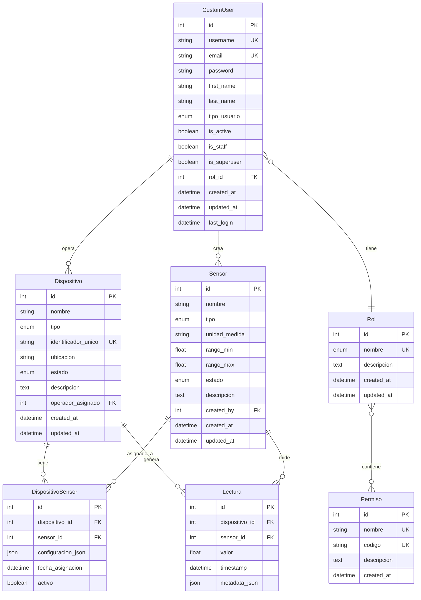

# 📊 Modelo Entidad-Relación - IoT Sensor Platform

## Diagrama ER (Formato Mermaid)



---

## Descripción Detallada de Entidades

### 1. CustomUser (Usuario Personalizado)
**Descripción**: Modelo de usuario extendido de AbstractUser de Django con campos adicionales para gestión de la plataforma IoT.

**Campos**:
- `id` (PK): Identificador único del usuario
- `username` (UK): Nombre de usuario único
- `email` (UK): Correo electrónico único
- `password`: Contraseña hasheada
- `first_name`: Nombre
- `last_name`: Apellido
- `tipo_usuario`: Tipo de usuario (interno/externo)
- `is_active`: Usuario activo o inactivo
- `is_staff`: Acceso al panel de administración
- `is_superuser`: Permisos de superusuario
- `rol_id` (FK): Relación con Rol
- `created_at`: Fecha de creación
- `updated_at`: Fecha de última actualización
- `last_login`: Último inicio de sesión

**Relaciones**:
- Tiene un `Rol` (many-to-one)
- Crea múltiples `Sensor` (one-to-many)
- Opera múltiples `Dispositivo` (one-to-many)

**Restricciones**:
- username debe ser único
- email debe ser único
- tipo_usuario: 'interno' o 'externo'

---

### 2. Rol
**Descripción**: Roles del sistema con permisos asociados.

**Campos**:
- `id` (PK): Identificador único del rol
- `nombre` (UK): Nombre del rol (superusuario/operador/solo_lectura)
- `descripcion`: Descripción del rol
- `created_at`: Fecha de creación
- `updated_at`: Fecha de última actualización

**Relaciones**:
- Contiene múltiples `Permiso` (many-to-many)
- Es asignado a múltiples `CustomUser` (one-to-many)

**Valores permitidos**:
- superusuario
- operador
- solo_lectura

---

### 3. Permiso
**Descripción**: Permisos individuales del sistema.

**Campos**:
- `id` (PK): Identificador único del permiso
- `nombre` (UK): Nombre descriptivo del permiso
- `codigo` (UK): Código único del permiso
- `descripcion`: Descripción detallada
- `created_at`: Fecha de creación

**Relaciones**:
- Pertenece a múltiples `Rol` (many-to-many)

**Ejemplos de códigos**:
- gestionar_usuarios
- gestionar_sensores
- gestionar_dispositivos
- crear_lecturas
- ver_lecturas

---

### 4. Sensor
**Descripción**: Sensores IoT que miden diferentes variables físicas.

**Campos**:
- `id` (PK): Identificador único del sensor
- `nombre`: Nombre descriptivo del sensor
- `tipo`: Tipo de sensor (temperatura, humedad, presión, etc.)
- `unidad_medida`: Unidad de medida (°C, %, hPa, etc.)
- `rango_min`: Valor mínimo permitido
- `rango_max`: Valor máximo permitido
- `estado`: Estado del sensor (activo/inactivo/mantenimiento)
- `descripcion`: Descripción adicional
- `created_by` (FK): Usuario que creó el sensor
- `created_at`: Fecha de creación
- `updated_at`: Fecha de última actualización

**Relaciones**:
- Creado por un `CustomUser` (many-to-one)
- Asignado a múltiples `Dispositivo` a través de `DispositivoSensor` (many-to-many)
- Genera múltiples `Lectura` (one-to-many)

**Tipos de sensor**:
- temperatura
- humedad
- presion
- luz
- movimiento
- gas
- sonido
- distancia
- acelerometro
- giroscopio
- otro

**Estados**:
- activo
- inactivo
- mantenimiento

**Validaciones**:
- rango_min < rango_max

---

### 5. Dispositivo
**Descripción**: Dispositivos IoT físicos que contienen sensores.

**Campos**:
- `id` (PK): Identificador único del dispositivo
- `nombre`: Nombre descriptivo del dispositivo
- `tipo`: Tipo de dispositivo (Raspberry Pi, ESP32, etc.)
- `identificador_unico` (UK): Identificador único del hardware
- `ubicacion`: Ubicación física del dispositivo
- `estado`: Estado del dispositivo (activo/inactivo/mantenimiento/desconectado)
- `descripcion`: Descripción adicional
- `operador_asignado` (FK): Usuario operador asignado
- `created_at`: Fecha de creación
- `updated_at`: Fecha de última actualización

**Relaciones**:
- Operado por un `CustomUser` (many-to-one)
- Contiene múltiples `Sensor` a través de `DispositivoSensor` (many-to-many)
- Genera múltiples `Lectura` (one-to-many)

**Tipos de dispositivo**:
- raspberry_pi
- esp32
- arduino
- esp8266
- stm32
- otro

**Estados**:
- activo
- inactivo
- mantenimiento
- desconectado

**Restricciones**:
- identificador_unico debe ser único

---

### 6. DispositivoSensor (Tabla intermedia)
**Descripción**: Tabla de relación many-to-many entre Dispositivo y Sensor con información adicional.

**Campos**:
- `id` (PK): Identificador único de la asignación
- `dispositivo_id` (FK): Dispositivo relacionado
- `sensor_id` (FK): Sensor relacionado
- `configuracion_json`: Configuración específica de la asignación en formato JSON
- `fecha_asignacion`: Fecha y hora de asignación
- `activo`: Si la asignación está activa

**Relaciones**:
- Pertenece a un `Dispositivo` (many-to-one)
- Pertenece a un `Sensor` (many-to-one)

**Restricciones**:
- La combinación (dispositivo_id, sensor_id) debe ser única

**Ejemplo de configuracion_json**:
```json
{
  "intervalo": 60,
  "umbral_alerta": 30,
  "prioridad": "alta"
}
```

---

### 7. Lectura
**Descripción**: Lecturas/mediciones realizadas por sensores en dispositivos.

**Campos**:
- `id` (PK): Identificador único de la lectura
- `dispositivo_id` (FK): Dispositivo que generó la lectura
- `sensor_id` (FK): Sensor que realizó la medición
- `valor`: Valor medido
- `timestamp`: Fecha y hora de la lectura
- `metadata_json`: Metadatos adicionales en formato JSON

**Relaciones**:
- Generada por un `Dispositivo` (many-to-one)
- Medida por un `Sensor` (many-to-one)

**Índices**:
- timestamp (descendente)
- (dispositivo_id, timestamp)
- (sensor_id, timestamp)

**Validaciones**:
- El valor debe estar dentro del rango (rango_min, rango_max) del sensor
- El sensor debe estar asignado al dispositivo

**Ejemplo de metadata_json**:
```json
{
  "calidad": "buena",
  "bateria": 85,
  "señal_wifi": -45,
  "version_firmware": "1.2.0"
}
```

---

## Relaciones Entre Entidades

### Relación: CustomUser - Rol
**Tipo**: Many-to-One (Muchos usuarios tienen un rol)
- Un usuario tiene un rol
- Un rol puede ser asignado a múltiples usuarios
- FK: `CustomUser.rol_id` → `Rol.id`
- Cascada: SET_NULL (si se elimina el rol, el usuario queda sin rol)

---

### Relación: Rol - Permiso
**Tipo**: Many-to-Many (Un rol tiene muchos permisos, un permiso puede estar en muchos roles)
- Un rol puede tener múltiples permisos
- Un permiso puede pertenecer a múltiples roles
- Tabla intermedia: Django genera automáticamente la tabla `api_rol_permisos`

---

### Relación: CustomUser - Sensor
**Tipo**: One-to-Many (Un usuario crea muchos sensores)
- Un usuario puede crear múltiples sensores
- Un sensor es creado por un usuario
- FK: `Sensor.created_by` → `CustomUser.id`
- Cascada: SET_NULL (si se elimina el usuario, el sensor mantiene su referencia como NULL)

---

### Relación: CustomUser - Dispositivo
**Tipo**: One-to-Many (Un usuario opera muchos dispositivos)
- Un usuario (operador) puede tener asignados múltiples dispositivos
- Un dispositivo tiene un operador asignado
- FK: `Dispositivo.operador_asignado` → `CustomUser.id`
- Cascada: SET_NULL (si se elimina el usuario, el dispositivo queda sin operador)

---

### Relación: Dispositivo - Sensor (a través de DispositivoSensor)
**Tipo**: Many-to-Many con información adicional
- Un dispositivo puede tener múltiples sensores
- Un sensor puede estar en múltiples dispositivos
- Tabla intermedia: `DispositivoSensor`
- FK: `DispositivoSensor.dispositivo_id` → `Dispositivo.id`
- FK: `DispositivoSensor.sensor_id` → `Sensor.id`
- Cascada: CASCADE (si se elimina dispositivo o sensor, se elimina la asignación)
- Unique Together: (dispositivo_id, sensor_id)

---

### Relación: Dispositivo - Lectura
**Tipo**: One-to-Many (Un dispositivo genera muchas lecturas)
- Un dispositivo puede generar múltiples lecturas
- Una lectura pertenece a un dispositivo
- FK: `Lectura.dispositivo_id` → `Dispositivo.id`
- Cascada: CASCADE (si se elimina el dispositivo, se eliminan sus lecturas)

---

### Relación: Sensor - Lectura
**Tipo**: One-to-Many (Un sensor genera muchas lecturas)
- Un sensor puede tener múltiples lecturas
- Una lectura pertenece a un sensor
- FK: `Lectura.sensor_id` → `Sensor.id`
- Cascada: CASCADE (si se elimina el sensor, se eliminan sus lecturas)

---

## Índices y Optimizaciones

### Índices Principales
1. **CustomUser**:
   - PK: id
   - UK: username
   - UK: email
   - INDEX: rol_id
   - INDEX: created_at (descendente)

2. **Sensor**:
   - PK: id
   - INDEX: tipo
   - INDEX: estado
   - INDEX: created_by
   - INDEX: created_at (descendente)

3. **Dispositivo**:
   - PK: id
   - UK: identificador_unico
   - INDEX: tipo
   - INDEX: estado
   - INDEX: operador_asignado
   - INDEX: created_at (descendente)

4. **Lectura**:
   - PK: id
   - INDEX: timestamp (descendente) - Para consultas por fecha
   - INDEX: (dispositivo_id, timestamp) - Para consultas por dispositivo
   - INDEX: (sensor_id, timestamp) - Para consultas por sensor

### Consideraciones de Rendimiento
- Las lecturas pueden crecer rápidamente → Considerar particionamiento por fecha
- Índices en timestamp para consultas de series temporales
- Índices compuestos para consultas frecuentes

---

## Reglas de Negocio

### Validaciones a Nivel de Modelo

1. **Sensor**:
   - rango_min debe ser menor que rango_max
   - Los valores de las lecturas deben estar dentro del rango

2. **Lectura**:
   - El sensor debe estar asignado al dispositivo (activo en DispositivoSensor)
   - El valor debe estar dentro del rango del sensor

3. **Dispositivo**:
   - identificador_unico debe ser único en toda la base de datos

4. **CustomUser**:
   - username y email deben ser únicos
   - No se puede desactivar un superusuario

### Permisos y Acceso

1. **Superusuario**:
   - Acceso completo a todas las entidades
   - Puede gestionar usuarios, roles, permisos
   - Puede asignar operadores a dispositivos

2. **Operador**:
   - Puede ver todos los sensores
   - Puede crear y gestionar sensores
   - Solo puede ver y gestionar sus dispositivos asignados
   - Puede crear lecturas para sus dispositivos
   - Solo puede ver lecturas de sus dispositivos

3. **Solo Lectura**:
   - Puede ver usuarios, sensores, dispositivos, lecturas
   - No puede crear, modificar o eliminar nada

---

## Consultas SQL Frecuentes

### Obtener lecturas de un dispositivo en las últimas 24 horas
```sql
SELECT l.*, s.nombre as sensor_nombre, s.unidad_medida
FROM api_lectura l
JOIN api_sensor s ON l.sensor_id = s.id
WHERE l.dispositivo_id = ?
  AND l.timestamp >= NOW() - INTERVAL '24 hours'
ORDER BY l.timestamp DESC;
```

### Obtener dispositivos con sus sensores asignados
```sql
SELECT d.*, s.nombre as sensor_nombre, ds.activo
FROM api_dispositivo d
LEFT JOIN api_dispositivosensor ds ON d.id = ds.dispositivo_id
LEFT JOIN api_sensor s ON ds.sensor_id = s.id
WHERE d.estado = 'activo';
```

### Estadísticas de lecturas por sensor
```sql
SELECT 
    s.nombre,
    COUNT(l.id) as total_lecturas,
    AVG(l.valor) as promedio,
    MIN(l.valor) as minimo,
    MAX(l.valor) as maximo
FROM api_sensor s
LEFT JOIN api_lectura l ON s.id = l.sensor_id
WHERE l.timestamp >= NOW() - INTERVAL '7 days'
GROUP BY s.id, s.nombre;
```

---

## Diagrama de Flujo de Datos

### Flujo: Creación de Lectura
1. Usuario autenticado (Operador o Superusuario)
2. Envía POST a `/api/readings/`
3. Validación: ¿Sensor asignado al dispositivo?
4. Validación: ¿Valor dentro del rango del sensor?
5. Crear lectura con timestamp actual
6. Retornar lectura creada

### Flujo: Asignación de Sensor a Dispositivo
1. Usuario autenticado (Operador o Superusuario)
2. Envía POST a `/api/devices/{id}/assign-sensor/`
3. Validación: ¿El dispositivo existe?
4. Validación: ¿El sensor existe?
5. Validación: ¿Ya está asignado?
6. Crear registro en DispositivoSensor
7. Retornar asignación creada

---

## Extensiones Futuras

### Fase 2 - Frontend
- Dashboard visual para usuarios
- Gráficos de series temporales
- Gestión de usuarios desde UI

### Fase 3 - EMQX/MQTT
- Tabla `MqttMessage` para almacenar mensajes
- Tabla `MqttTopic` para gestionar topics
- Relación Dispositivo-MqttTopic
- Procesamiento en tiempo real de lecturas

### Fase 4 - Alertas
- Tabla `Alerta` con umbrales configurables
- Tabla `NotificacionAlerta` para historial
- Relación Sensor-Alerta

### Fase 5 - Análisis
- Tabla `ModeloPrediccion` para ML
- Tabla `PrediccionLectura` para predicciones
- Agregaciones y análisis estadísticos

---

Este modelo está optimizado para:
- 📊 Consultas de series temporales eficientes
- 🔐 Control de acceso granular por roles
- 📈 Escalabilidad para grandes volúmenes de lecturas
- 🔗 Flexibilidad para agregar nuevos tipos de sensores y dispositivos
- 🛠️ Extensibilidad para futuras integraciones (EMQX, alertas, ML)
